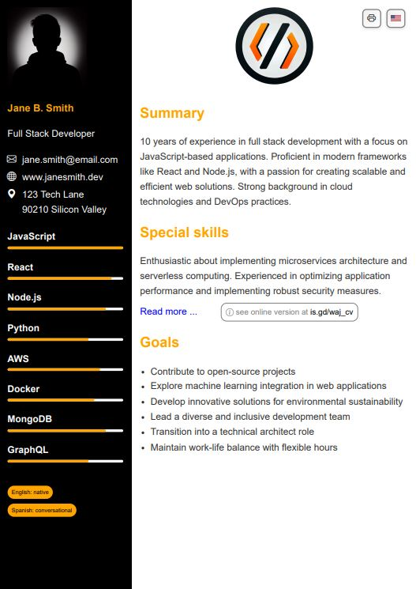

# CV Maker

Makes a resume from data in a yml file. Code was done 60% by AI with manual fixes as needed.

Project state
----------------------------------------------------------

Currently minimal version for personal use

LICENSE
----------------------------------------------------------

Copyright (C) Walter A. Jablonowski 2024, free for non-commercial use currently under MIT [License](https://choosealicense.com/licenses/agpl-3.0)

This app is build upon PHP and free software (see [credits](credits.md)).

[Privacy](https://walter-a-jablonowski.github.io/privacy.html) | [Legal](https://walter-a-jablonowski.github.io/imprint.html)
